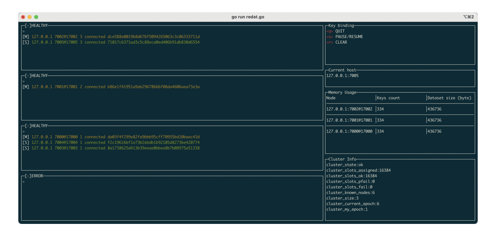

# Redat

## Features:

* Visualize master-replicas relations in the Redis cluster 
* Monitor with metrics: memory, cluster's stats, 

## Configuration

* clusterIps: list of nodes' ip in the cluster
* clusterPorts: corresponding port of each ip

E.g:

```yml
cluster:
  clusterIps: ['127.0.0.1','127.0.0.1','127.0.0.1','127.0.0.1','127.0.0.1','127.0.0.1']
  clusterPorts: ['7001','7002','7003','7004','7005', '7000']
```

## Getting started

```shell
go mod vendor
go run redat.go
```

## Overview

<div align="center">
	
</div>

## License

[MIT](./LICENSE)